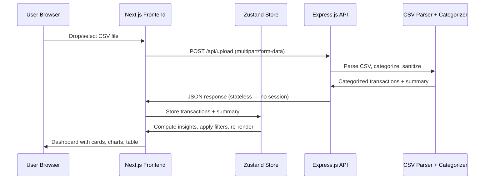

# Finboard — Finance CSV Visualizer

## Enhancement Summary

**Deepened on:** 2026-03-26
**Sections enhanced:** All 6 phases + architecture + security
**Research agents used:** architecture-strategist, kieran-typescript-reviewer, performance-oracle, security-sentinel, julik-frontend-races-reviewer, code-simplicity-reviewer, pattern-recognition-specialist, best-practices-researcher, framework-docs-researcher, frontend-design-skill

### Key Improvements
1. **Simplified architecture** — removed session management (stateless backend), reduced to 2 charts, 2 filters, ~30 files total
2. **Security hardened** — CSV injection sanitization, rate limiting, helmet, reduced file limit to 5MB, transaction cap at 10K rows
3. **Performance optimized** — single-pass filtering, aggregated chart data, code-split dashboard, paginate at selector level
4. **Type-safe foundations** — branded types, readonly everywhere, discriminated status unions, noUncheckedIndexedAccess
5. **Polished design system** — "Refined Ledger" editorial aesthetic with Newsreader serif + DM Sans, warm parchment palette
6. **Race condition mitigations** — upload state machine with AbortController, atomic filter reset on new data, container-level animations

### Simplifications Applied (from Simplicity Review)
- Stateless backend — no express-session, frontend uses Zustand persist to sessionStorage
- 2 charts (pie + bar) instead of 3 — area chart deferred to v2
- 2 filters (search + category) instead of 4 — date range and amount range deferred to v2
- Insights computed on frontend only — removed backend analyzer service
- Docker/CI deferred to Phase 5 (final phase)
- Flat component directory structure
- ~30 files instead of ~50

---

## Overview

Build a bootcamp-quality, production-ready personal finance CSV visualizer as a full-stack monorepo application. Users upload bank statement CSVs, the backend parses and auto-categorizes transactions, and the frontend renders an interactive dashboard with summary cards, charts, filters, search, and insights.

**Tech Stack:** pnpm monorepo with Turborepo, Next.js 15 (App Router), Zustand, Tailwind CSS v4 (`@theme` CSS config), shadcn/ui, Motion (formerly Framer Motion, import from `"motion/react"`), Recharts v3, Express.js backend, PapaParse (server-side CSV parsing), GitHub Actions CI, Docker multi-stage deployment.

## Problem Statement / Motivation

Personal finance tools are either overly complex (Mint, YNAB) or require account linking. Many users just want to drop a CSV export from their bank and see a clear breakdown of their spending. Finboard fills this gap as a lightweight, privacy-first tool — no accounts, no database, no data stored permanently.

This also serves as a comprehensive bootcamp capstone project demonstrating: monorepo architecture, full-stack TypeScript, modern React patterns, REST API design, CI/CD, Docker deployment, and polished UI/UX.

## Proposed Solution

### Architecture

```
Finboard/
├── apps/
│   ├── web/                    # Next.js 15 frontend
│   │   ├── app/                # App Router pages
│   │   │   ├── layout.tsx      # Root layout (fonts, metadata)
│   │   │   ├── page.tsx        # Main page (upload or dashboard)
│   │   │   └── globals.css     # Tailwind v4 @theme config
│   │   ├── components/         # All React components (flat)
│   │   │   ├── ui/             # shadcn/ui primitives
│   │   │   ├── Header.tsx
│   │   │   ├── UploadZone.tsx
│   │   │   ├── Dashboard.tsx
│   │   │   ├── SummaryCards.tsx
│   │   │   ├── SpendingPieChart.tsx
│   │   │   ├── IncomeExpenseChart.tsx
│   │   │   ├── InsightsPanel.tsx
│   │   │   ├── TransactionTable.tsx
│   │   │   ├── FilterBar.tsx
│   │   │   └── EmptyState.tsx
│   │   ├── hooks/              # Cross-store derived selectors
│   │   │   └── useFilteredData.ts
│   │   ├── store/              # Zustand stores
│   │   │   ├── transactionStore.ts
│   │   │   └── filterStore.ts
│   │   └── lib/                # API client, utilities
│   │       ├── api.ts
│   │       ├── analytics.ts    # Summary/insight computation (frontend-only)
│   │       └── formatters.ts   # Currency, date formatting
│   └── api/                    # Express.js backend
│       ├── src/
│       │   ├── index.ts        # Express app, middleware, routes
│       │   ├── routes/
│       │   │   └── upload.ts   # POST /api/upload handler
│       │   ├── services/
│       │   │   ├── parser.ts   # CSV parsing + date detection (PapaParse)
│       │   │   └── categorizer.ts  # Keyword-based categorization
│       │   ├── data/
│       │   │   └── categories.ts   # Category dictionary + keywords
│       │   └── types.ts        # Backend-internal types only
│       └── package.json
├── packages/
│   └── shared/                 # Shared types and constants (no build step)
│       ├── src/
│       │   ├── index.ts        # Barrel export
│       │   ├── types.ts        # Transaction, Category, Summary types
│       │   └── constants.ts    # CATEGORIES, LIMITS
│       └── package.json
├── .github/workflows/ci.yml   # CI (deferred to Phase 5)
├── docker/                     # Docker (deferred to Phase 5)
├── docker-compose.yml
├── turbo.json
├── pnpm-workspace.yaml
├── package.json
├── tsconfig.base.json          # Strict base TypeScript config
├── .gitignore
├── CLAUDE.md
└── README.md
```

### Design System: "Refined Ledger" — Editorial Finance

**Aesthetic:** Bloomberg Terminal's information density married with a premium Swiss design magazine. Not playful, not corporate — *authoritative and calm*.

**Typography:**
| Role | Font | Rationale |
|------|------|-----------|
| Display/headings & card values | **Newsreader** (serif) | Editorial authority; old-style figures perfect for currency |
| Body/UI text | **DM Sans** | Geometric sans with warmth and readability |
| Numbers/table data | **JetBrains Mono** | Makes numbers scan fast |

**Color Palette (warm parchment base with desaturated accents):**
```css
@theme {
  /* Surfaces */
  --color-surface-primary: #FAFAF7;    /* warm parchment */
  --color-surface-secondary: #F2F0EB;  /* card backgrounds */
  --color-surface-tertiary: #E8E5DE;   /* hover, borders */
  --color-surface-inverse: #1C1917;    /* header */

  /* Semantic accents */
  --color-income: #16653A;       /* deep forest green */
  --color-income-bg: #ECFDF5;
  --color-expense: #B91C1C;      /* brick red */
  --color-expense-bg: #FEF2F2;
  --color-balance: #1D4E89;      /* navy blue */
  --color-balance-bg: #EFF6FF;

  /* Chart palette (11 categories) */
  --color-chart-1: #2D6A4F;  /* Food & Dining */
  --color-chart-2: #6B4C9A;  /* Shopping */
  --color-chart-3: #C06014;  /* Transportation */
  --color-chart-4: #1D4E89;  /* Housing */
  --color-chart-5: #92782A;  /* Utilities */
  --color-chart-6: #B44D6C;  /* Entertainment */
  --color-chart-7: #3B7A8B;  /* Health */
  --color-chart-8: #5C6B3C;  /* Subscriptions */
  --color-chart-9: #16653A;  /* Income */
  --color-chart-10: #8B6B4A; /* Transfer */
  --color-chart-11: #78716C; /* Other */

  --color-masthead: #C4A35A;  /* gold accent line under header */

  /* Fonts */
  --font-display: 'Newsreader', Georgia, serif;
  --font-body: 'DM Sans', sans-serif;
  --font-mono: 'JetBrains Mono', monospace;
}
```

**Layout Signature:** Asymmetric chart grid (1/3 pie + 2/3 bar), left accent bars on summary cards, thin gold masthead line under header. No shadows on cards — flat with thin borders (editorial, not SaaS).

### Data Flow



### API Contract

**POST /api/upload**
- Request: `multipart/form-data` with `file` field (CSV, max 5MB)
- Response:
```typescript
interface UploadResponse {
  readonly transactions: readonly Transaction[];
  readonly summary: Summary;
  readonly warnings: readonly string[];
  readonly metadata: {
    readonly rowsParsed: number;
    readonly rowsSkipped: number;
    readonly detectedFormat: { readonly dateFormat: DateFormat; readonly delimiter: Delimiter };
  };
}
```

**Error Response:**
```typescript
interface ErrorResponse {
  readonly error: {
    readonly message: string;
    readonly code: "INVALID_FILE_TYPE" | "FILE_TOO_LARGE" | "PARSE_FAILED" | "NO_FILE" | "RATE_LIMITED" | "INTERNAL_ERROR";
  };
}
```

**GET /api/health**
- Response: `{ "status": "ok" }`

### Research Insights: Architecture

**Stateless backend (from Simplicity + Architecture reviews):** No express-session. The upload endpoint receives CSV, returns JSON, forgets. Frontend stores data in Zustand with `persist` middleware to `sessionStorage`. On page refresh, Zustand rehydrates from sessionStorage. This eliminates session isolation concerns, memory leaks, cookie management, and CORS credential complexity.

**Insights computed frontend-only (from Simplicity + Architecture reviews):** Summary (totals, averages) and insights (top category, biggest expense) are computed by the frontend from the transaction array. This avoids logic duplication between backend and frontend when filters are applied.

**Shared package stays lean (reconciling Simplicity vs Architecture):** `packages/shared` contains only TypeScript types and constants — no build step, consumed as raw `.ts` via transpilePackages. Both apps import the same types, preventing API contract drift.

---

## Technical Approach

### Phase 1: Project Scaffolding & Monorepo Setup

**Tasks:**
- Initialize pnpm monorepo with Turborepo
- Set up Next.js 15 with App Router, Tailwind CSS v4 (`@import "tailwindcss"` + `@theme`), shadcn/ui
- Set up Express.js with TypeScript
- Create shared types package (no build step)
- Configure strict TypeScript base config
- Configure ESLint (with `react/no-danger: error`), Prettier
- Create .gitignore, CLAUDE.md, initial README.md
- Install fonts (Newsreader, DM Sans, JetBrains Mono via next/font)

**Success Criteria:**
- `pnpm dev` starts both frontend (port 3000) and backend (port 3001)
- `pnpm build` succeeds for all packages
- `pnpm lint` and `pnpm typecheck` pass

### Research Insights: Scaffolding

**Tailwind CSS v4 (from Framework Docs):** No `tailwind.config.js` needed. Configuration goes in `globals.css`:
```css
@import "tailwindcss";

@theme {
  --color-income: #16653A;
  --color-expense: #B91C1C;
  --font-display: 'Newsreader', Georgia, serif;
  /* ... full palette above ... */
}
```
PostCSS config: `{ plugins: { "@tailwindcss/postcss": {} } }`

**TypeScript strict config (from TypeScript Review):**
```jsonc
// tsconfig.base.json
{
  "compilerOptions": {
    "strict": true,
    "noUncheckedIndexedAccess": true,     // CRITICAL for CSV parsing safety
    "exactOptionalPropertyTypes": true,
    "noUnusedLocals": true,
    "noImplicitReturns": true,
    "isolatedModules": true,
    "moduleResolution": "bundler",
    "module": "ESNext",
    "target": "ES2022"
  }
}
```

**Turborepo pipeline (from Best Practices):**
```jsonc
{
  "tasks": {
    "build": {
      "dependsOn": ["^build"],
      "inputs": ["src/**", "package.json", "tsconfig.json"],
      "outputs": ["dist/**", ".next/**", "!.next/cache/**"]
    },
    "dev": { "cache": false, "persistent": true },
    "lint": { "inputs": ["src/**"] },
    "typecheck": { "dependsOn": ["^build"] }
  }
}
```

**Shared package (from TypeScript Review):** No build step — point `main` and `types` at raw source:
```jsonc
{
  "name": "@finboard/shared",
  "private": true,
  "main": "./src/index.ts",
  "types": "./src/index.ts"
}
```

**Shared types with branded types (from TypeScript Review):**
```typescript
// packages/shared/src/types.ts
type Brand<T, B extends string> = T & { readonly __brand: B };
export type DateString = Brand<string, "DateString">;
export type TransactionId = Brand<string, "TransactionId">;

export const CATEGORIES = [
  "Food & Dining", "Groceries", "Shopping", "Transportation",
  "Housing", "Utilities", "Entertainment", "Health",
  "Subscriptions", "Income", "Transfer", "Other",
] as const;
export type Category = (typeof CATEGORIES)[number];
export type TransactionType = "income" | "expense";

export interface Transaction {
  readonly id: TransactionId;
  readonly date: DateString;
  readonly description: string;
  readonly amount: number;
  readonly category: Category;
  readonly type: TransactionType;
}

export interface Summary {
  readonly totalIncome: number;
  readonly totalExpenses: number;
  readonly netBalance: number;
  readonly transactionCount: number;
  readonly dateRange: { readonly start: DateString; readonly end: DateString };
}
```

**Files:**
- `package.json`, `pnpm-workspace.yaml`, `turbo.json`, `tsconfig.base.json`
- `apps/web/package.json`, `apps/web/next.config.ts`, `apps/web/tsconfig.json`
- `apps/web/app/layout.tsx`, `apps/web/app/page.tsx`, `apps/web/app/globals.css`
- `apps/web/postcss.config.mjs`
- `apps/web/components/ui/` — shadcn/ui (Button, Card, Input, Select, Table)
- `apps/api/package.json`, `apps/api/tsconfig.json`, `apps/api/src/index.ts`
- `packages/shared/package.json`, `packages/shared/src/index.ts`, `packages/shared/src/types.ts`, `packages/shared/src/constants.ts`
- `.gitignore`, `CLAUDE.md`, `README.md`

---

### Phase 2: Backend — CSV Upload, Parsing & Categorization

**Tasks:**
- Implement file upload endpoint with multer (5MB limit, CSV only, memoryStorage)
- Add content validation (null byte check, delimiter detection, min 2 lines)
- Add CSV cell sanitization (strip formula injection prefixes `=+\-@`, control chars, length cap 200)
- Build CSV parser service using PapaParse (`dynamicTyping: false`, `skipEmptyLines: "greedy"`)
  - Auto-detect delimiter via `delimitersToGuess`
  - Header normalization via `transformHeader` (trim, lowercase, underscore)
  - Auto-detect column mapping via header alias matching
  - Handle BOM stripping
  - Skip invalid rows, collect warnings (max 10K rows processed)
- Build amount parser (handle `$1,234.56`, `(50.00)`, `-$45.00`, debit/credit columns)
- Build date parser (support YYYY-MM-DD, MM/DD/YYYY, DD/MM/YYYY with heuristic)
- Build categorizer with priority-weighted keyword dictionary
  - 12 categories, ~150 keywords, pre-compiled regex per category
  - Priority ordering (e.g., "Uber Eats" matches Food at priority 9 before Transportation at priority 7)
  - Income detection: positive amounts + income keywords
- Build summary calculator (totals, averages, date ranges)
- Add `helmet` security headers
- Add rate limiting (`express-rate-limit`: 10 uploads/15min, 100 requests/15min global)
- Add CORS middleware (explicit origin allowlist from env var)
- Add error handling middleware (structured error responses, never expose internals)
- Add health check endpoint
- Add `compression` middleware for gzipped responses

### Research Insights: Backend Security & Performance

**CSV injection (CRITICAL — from Security Review):** Sanitize ALL cell values server-side:
```typescript
function sanitizeCsvValue(value: string): string {
  let clean = value.replace(/^\uFEFF/, '');
  if (/^[=+\-@\t\r]/.test(clean)) clean = "'" + clean;
  clean = clean.replace(/\0/g, '');
  return clean.substring(0, 200);
}
```

**Pre-compiled regex categorizer (from Performance Review):**
```typescript
const categoryPatterns = new Map<string, RegExp>();
for (const rule of CATEGORY_RULES) {
  categoryPatterns.set(rule.category, new RegExp(rule.keywords.join('|'), 'i'));
}
// Per-row: single regex test instead of N includes() calls
```

**Multer security (from Security Review):** Use `memoryStorage()`, validate content after upload:
```typescript
const upload = multer({
  storage: multer.memoryStorage(),
  limits: { fileSize: 5 * 1024 * 1024, files: 1, fields: 0 },
  fileFilter: (_req, file, cb) => {
    if (path.extname(file.originalname).toLowerCase() !== '.csv') {
      return cb(new Error('Only .csv files are allowed'));
    }
    cb(null, true);
  },
});
```

**PapaParse config (from Best Practices):**
```typescript
Papa.parse(csvString, {
  header: true,
  dynamicTyping: false,        // NEVER for financial data
  skipEmptyLines: "greedy",
  transformHeader: (h) => h.trim().toLowerCase().replace(/\s+/g, "_"),
  delimitersToGuess: [",", "\t", ";", "|"],
});
```

**Files:**
- `apps/api/src/index.ts` — Express app, helmet, cors, rate limiter, compression, routes
- `apps/api/src/routes/upload.ts` — POST /api/upload handler
- `apps/api/src/services/parser.ts` — CSV parsing + date detection + sanitization
- `apps/api/src/services/categorizer.ts` — Priority-weighted keyword categorization
- `apps/api/src/data/categories.ts` — Category rules + keyword dictionary
- `apps/api/src/types.ts` — Backend-only types (RawCsvRow, ColumnMapping, ParseResult)

---

### Phase 3: Frontend — Upload UX, Store & Dashboard Layout

**Tasks:**
- Build app layout with header (dark `surface-inverse`, gold masthead accent line)
- Build empty state / landing page with upload CTA (full viewport height)
- Build drag-and-drop upload zone with:
  - Visual feedback on drag-over (solid border, scale 1.01)
  - File type + size validation (CSV, 5MB, client-side)
  - Upload state machine: `idle | uploading | success | error`
  - AbortController to prevent concurrent uploads
  - Disable drop zone during upload (guard in onDrop handler, not just CSS)
  - Success/error animations (Motion)
- Build Zustand stores:
  - `transactionStore`: transactions[], summary, warnings, status (discriminated union: `"idle" | "loading" | "success" | "error"`), errorMessage
  - `filterStore`: categories[], searchQuery + actions + clearAll
  - Persist to sessionStorage via `zustand/middleware/persist`
- Build derived selector hooks in `hooks/useFilteredData.ts`:
  - `useFilteredTransactions()` — pure function, single-pass filter, Set-based category lookup
  - `useFilteredSummary()` — recompute from filtered transactions
  - `useFilteredInsights()` — top category, biggest expense, daily average
  - All memoized with `useMemo`, individual Zustand selectors for referential stability
- Build API client with typed fetch wrapper
- Wire upload flow: drop → loading → API call → store → atomic filter reset → dashboard
- Reset all filters atomically when new data arrives (race condition mitigation)

### Research Insights: Frontend State & Races

**Upload state machine (from Races Review):**
```typescript
interface TransactionState {
  status: "idle" | "loading" | "success" | "error";
  // NOT separate isLoading + isError booleans
}
```

**Single-pass filtering (from Performance Review):**
```typescript
const categorySet = new Set(selectedCategories);
return transactions.filter((t) => {
  if (categorySet.size > 0 && !categorySet.has(t.category)) return false;
  if (query && !t.description.toLowerCase().includes(lowerQuery)) return false;
  return true;
});
```

**Atomic filter reset on new upload (from Races Review):**
```typescript
setUploadResult: (response) => {
  set({ transactions: response.transactions, /* ... */ status: "success" });
  useFilterStore.getState().clearAll(); // Reset filters atomically
}
```

**Zustand selectors — select individually (from TypeScript Review):**
```typescript
export function useFilteredTransactions() {
  const transactions = useTransactionStore((s) => s.transactions);
  const categories = useFilterStore((s) => s.categories);
  const searchQuery = useFilterStore((s) => s.searchQuery);
  return useMemo(() => filterTransactions(transactions, { categories, searchQuery }),
    [transactions, categories, searchQuery]);
}
```

**Files:**
- `apps/web/app/layout.tsx`, `apps/web/app/page.tsx`, `apps/web/app/globals.css`
- `apps/web/components/Header.tsx`
- `apps/web/components/UploadZone.tsx`
- `apps/web/components/EmptyState.tsx`
- `apps/web/components/Dashboard.tsx`
- `apps/web/store/transactionStore.ts`, `apps/web/store/filterStore.ts`
- `apps/web/hooks/useFilteredData.ts`
- `apps/web/lib/api.ts`, `apps/web/lib/analytics.ts`, `apps/web/lib/formatters.ts`

---

### Phase 4: Frontend — Dashboard Cards, Charts, Table & Insights

**Tasks:**
- Build summary cards row (Motion stagger entrance, 0.08s per card):
  - Total Income (forest green, left accent bar)
  - Total Expenses (brick red, left accent bar)
  - Net Balance (navy blue, left accent bar)
  - Transaction Count (stone, left accent bar)
  - Values in Newsreader serif (tabular-nums), labels in DM Sans uppercase tracking-wide
- Build chart section (asymmetric: 1/3 pie + 2/3 bar):
  - Spending by Category — Recharts donut PieChart (innerRadius 60%), total in center, custom dark tooltip
  - Income vs Expenses — Recharts BarChart (monthly grouped, rounded corners)
  - Aggregate data BEFORE passing to charts (by category for pie, by month for bar)
  - Disable Recharts animation when data exceeds 100 points
- Build insights panel (3 columns):
  - Top spending category with percentage
  - Biggest single expense
  - Average daily spending
  - Hide insights that can't be computed, show helper text
- Build transaction table:
  - Columns: Date, Description, Category, Amount
  - Sortable by any column
  - Color-coded amounts (green income, red expense) in JetBrains Mono
  - Category badges (pill-shaped, chart color at 10% opacity)
  - Pagination (25 per page) — paginate at selector level, never pass full array
  - No AnimatePresence on rows — animate the table container with subtle opacity transition
- `React.memo` on ALL chart/card/table components
- Code-split Dashboard with `next/dynamic` (Recharts ~150KB not loaded until after upload)
- Use `LazyMotion` with `domAnimation` feature set (~20KB savings)

### Research Insights: Charts & Animation

**Recharts donut with center label (from Context7):**
```tsx
<PieChart>
  <Pie data={categoryData} innerRadius={60} outerRadius={100} dataKey="amount">
    {categoryData.map((entry, i) => <Cell key={i} fill={CHART_COLORS[i]} />)}
    <Label position="center" content={({ viewBox }) => (
      <text x={viewBox.cx} y={viewBox.cy} textAnchor="middle"
            className="font-display text-2xl fill-surface-inverse">
        ${totalExpenses.toLocaleString()}
      </text>
    )} />
  </Pie>
  <Tooltip content={<CustomTooltip />} />
</PieChart>
```

**Container-level animation, NOT per-row (from Races Review):**
```tsx
<motion.div
  key={filterFingerprint}
  initial={{ opacity: 0.8 }}
  animate={{ opacity: 1 }}
  transition={{ duration: 0.15 }}
>
  <Table>{/* rows without AnimatePresence */}</Table>
</motion.div>
```

**Stagger animation timing (from Design Review):**
```typescript
const containerVariants = {
  hidden: {},
  visible: { transition: { staggerChildren: 0.08, delayChildren: 0.1 } },
};
const cardVariants = {
  hidden: { opacity: 0, y: 12 },
  visible: { opacity: 1, y: 0, transition: { duration: 0.4, ease: [0.25, 0.1, 0.25, 1] } },
};
```

**Gate entrance animations to first load only (from Races Review):** Don't replay stagger on re-upload.

**Files:**
- `apps/web/components/SummaryCards.tsx`
- `apps/web/components/SpendingPieChart.tsx`
- `apps/web/components/IncomeExpenseChart.tsx`
- `apps/web/components/InsightsPanel.tsx`
- `apps/web/components/TransactionTable.tsx`

---

### Phase 5: Filters, Polish, Documentation & Deployment

**Tasks:**
- Build filter bar (sticky, backdrop-blur):
  - Category multi-select dropdown (shadcn/ui Select with checkboxes)
  - Search input (debounced 300ms, DM Sans, magnifying glass icon)
  - Active filter count badge on "Clear filters" button
  - "No results" empty state when filters match nothing
- Cancel search debounce timer when new upload starts
- Add sample CSV file for demo/testing (~50 realistic transactions)
- Add loading skeletons matching dashboard layout
- Ensure responsive design:
  - Desktop 1024px+: 4-column cards, asymmetric charts
  - Tablet 768px: 2x2 cards, stacked charts
  - Mobile 375px: stacked cards, horizontal-scroll table
- Write comprehensive README.md
- Write CLAUDE.md with project conventions
- Set up GitHub Actions CI (lint + typecheck + build)
- Set up Docker (multi-stage builds, non-root user, read-only filesystem)
- Final QA pass

### Research Insights: Filters & Polish

**Debounce at selector level (from Performance Review):** Update filterStore immediately (for responsive UI), but debounce the derived computation:
```typescript
// SearchInput: immediate store update
const setSearchQuery = useFilterStore((s) => s.setSearchQuery);
const debouncedSet = useDebouncedCallback(setSearchQuery, 300);
```

**Disable chart animation during active filtering (from Performance + Races):**
```tsx
<Pie isAnimationActive={!isFilterChanging} ... />
```

**Responsive layout (from Design Review):**
- Desktop: `grid-cols-4` cards, `grid-cols-3` (1fr 2fr) charts
- Tablet: `grid-cols-2` cards, stacked charts
- Mobile: stacked, table with horizontal scroll

**Docker hardening (from Security Review):**
```dockerfile
RUN addgroup --system app && adduser --system --ingroup app app
USER app
```

**Files:**
- `apps/web/components/FilterBar.tsx`
- `apps/web/public/sample.csv`
- `README.md`, `CLAUDE.md`
- `.github/workflows/ci.yml`
- `docker/web.Dockerfile`, `docker/api.Dockerfile`, `docker-compose.yml`

---

## Security Requirements

*(Added from Security Audit — 14 findings, 2 CRITICAL)*

### CRITICAL
1. **CSV injection sanitization** — Strip formula prefixes (`=`, `+`, `-`, `@`) from all CSV cell values during server-side parsing
2. **Memory exhaustion protection** — 5MB file limit, 10K row cap, rate limiting (10 uploads/15min per IP)

### HIGH
3. **File upload validation** — memoryStorage only, extension + content validation (null byte check)
4. **Rate limiting** — `express-rate-limit` on upload endpoint + global
5. **Input sanitization** — Strip control characters, cap field length at 200 chars
6. **Security headers** — `helmet` middleware (CSP, X-Frame-Options, etc.)
7. **ESLint rule** — `react/no-danger: error` to prevent XSS via dangerouslySetInnerHTML

### MEDIUM
8. **CORS** — Explicit origin allowlist from `CORS_ORIGINS` env var, no wildcards
9. **Error responses** — Never expose stack traces, file paths, or internal details
10. **Warnings** — Never include raw CSV content in warning messages
11. **Docker** — Non-root user, read-only filesystem, drop capabilities

---

## Acceptance Criteria

### Functional Requirements
- [ ] CSV upload via drag-and-drop and file picker
- [ ] Backend parses CSV with auto-detected delimiters and column headers
- [ ] Transactions categorized into 12 categories via priority-weighted keyword matching
- [ ] Dashboard displays 4 summary cards (income, expenses, net, count)
- [ ] Spending by category donut chart
- [ ] Income vs expenses bar chart
- [ ] Insights panel with top category, biggest expense, daily average
- [ ] Transaction table with sort and pagination (25/page)
- [ ] Category multi-select filter
- [ ] Search by description (debounced 300ms)
- [ ] Filters combine with AND logic and affect all dashboard components
- [ ] Empty states for no data and no filter matches
- [ ] Error handling for invalid files with clear messages
- [ ] Sample CSV works end-to-end

### Non-Functional Requirements
- [ ] Responsive design (mobile 375px to desktop 1440px)
- [ ] Smooth entrance animations (Motion, 60fps, stagger 0.08s)
- [ ] CSV parsing < 2s for typical bank statement (~500 rows)
- [ ] Filter changes reflect in UI within 100ms
- [ ] 5MB file size limit enforced client and server side
- [ ] 10K row processing cap
- [ ] Rate limiting on upload endpoint
- [ ] CSV injection sanitization
- [ ] Helmet security headers
- [ ] TypeScript strict mode with noUncheckedIndexedAccess
- [ ] ESLint + Prettier configured and passing

### Quality Gates
- [ ] `pnpm build` succeeds
- [ ] `pnpm lint` passes (including react/no-danger)
- [ ] `pnpm typecheck` passes
- [ ] GitHub Actions CI green
- [ ] Docker build succeeds
- [ ] README has clear run instructions

---

## Dependencies & Prerequisites

- Node.js 20 LTS
- pnpm 9+
- Docker & Docker Compose (for deployment)
- multer >=2.0.2 (CVE-2025-47935 and CVE-2025-47944 fixes)
- No external APIs or services required
- No database required

## Risk Analysis & Mitigation

| Risk | Impact | Mitigation |
|------|--------|------------|
| CSV format variations | Miscategorized/unparsed data | Auto-detect + header aliases + partial success + warnings |
| CSV injection | Code execution in downstream tools | Server-side cell sanitization (strip formula prefixes) |
| Memory exhaustion | Server crash | 5MB limit, 10K row cap, rate limiting |
| Large dataset browser perf | Slow filtering, janky charts | Aggregate chart data, paginate at selector, single-pass filter |
| Tailwind v4 + Next.js 15 compat | Build issues | Use latest stable, test early in Phase 1 |
| Motion library rename | Import errors | Use `"motion/react"` not `"framer-motion"` |

## References & Research

### Technology Documentation
- Next.js 15 App Router: https://nextjs.org/docs
- Zustand: https://zustand-demo.pmnd.rs/
- shadcn/ui: https://ui.shadcn.com/
- Recharts v3: https://recharts.org/
- Motion (Framer Motion): https://motion.dev/ — import from `"motion/react"`
- PapaParse: https://www.papaparse.com/
- Turborepo: https://turbo.build/repo
- Tailwind CSS v4: https://tailwindcss.com/docs — uses `@theme` CSS directive, not JS config
- Express.js: https://expressjs.com/
- Multer >=2.0.2: https://github.com/expressjs/multer
